#  KaarYab Afghanistan

<p align="center">
  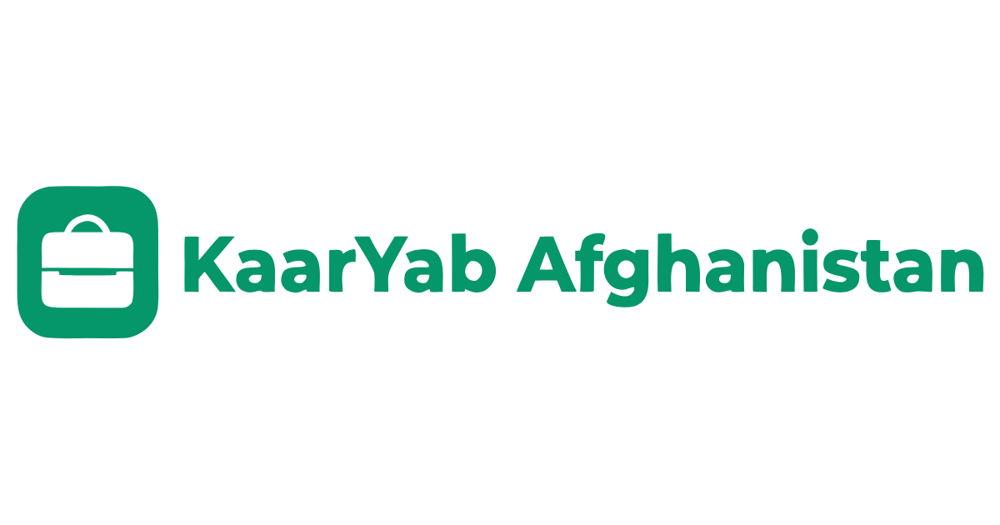
</p>

<p align="center">
  <b>Modern Opportunity Finder Platform for Afghan Youth</b>
</p>

<p align="center">


</p>

---

## Table of Contents

- Overview
- Project Description
- Problem It Solves
- Features
- Tech Stack
- Installation
- Environment Variables
- Running Locally
- Demo Admin
- Screenshots
- Live Demo
- GitHub Repository
- Future Improvements

---

# KaarYab Afghanistan

KaarYab Afghanistan is a modern opportunity finder platform that helps Afghan youth discover jobs, internships, scholarships, remote work, online courses, training programs, and volunteer opportunities in one place.

---

# Project Description

This is a final capstone project built with: Next.js App Router, TypeScript, React, Tailwind CSS, LocalStorage, mock API route handlers, React Hook Form, Zod, Recharts, Framer Motion, resend, and jsPDF.
---

# Problem It Solves

Opportunity information for Afghan students, graduates, job seekers, and organizations is scattered across different websites and social media.

KaarYab Afghanistan brings all opportunities together into one searchable, filterable, saveable, and manageable platform.

---

# Features

- Featured Opportunities

- Advanced Search

- Smart Filters

- Opportunity Details

- Save Opportunities

- Local CRUD

- Dashboard Analytics

- Dark Mode

- Mock Authentication

- Admin Approval System

- Contact Form

- PDF CV Builder

- Responsive Design

---

# Tech Stack

| Category | Technologies |
|-----------|-------------|
| Framework | Next.js 16 |
| UI | React 19 |
| Language | TypeScript |
| Styling | Tailwind CSS |
| Forms | React Hook Form + Zod |
| Charts | Recharts |
| Animation | Framer Motion |
| Email | Resend |
| PDF | jsPDF |
| Icons | Lucide React |
| Storage | LocalStorage |

---

#  Installation

Clone the repository

```bash
git clone https://github.com/SajedaHussaini/kaaryab-afghanistan.git

cd kaaryab-afghanistan
```

Install dependencies

```bash
npm install
```

---

#  Environment Variables

Create a `.env.local`

```env
RESEND_API_KEY=your_resend_api_key
```

---

#  Running Locally

```bash
npm run dev
```

Open

```
http://localhost:3000
```

Useful commands

```bash
npm run lint
npm run build
```

---

# Demo Admin

| Field | Value |
|-------|------|
| Name | KaarYab Admin |
| Email | admin@kaaryab.af |
| Role | admin |

Visit

```
/auth
```

then

```
/dashboard
```

---

# Screenshots

## Home

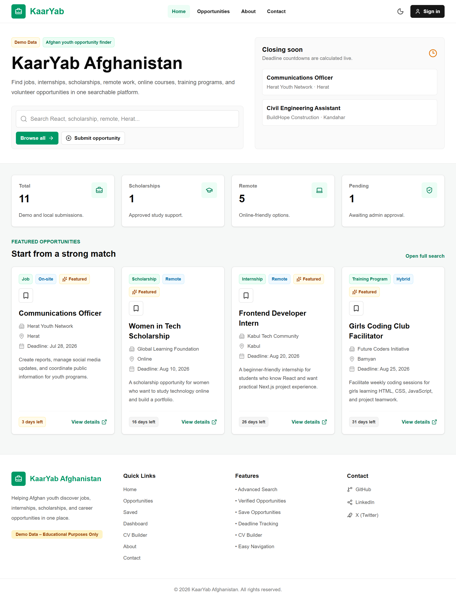

---

## Opportunities

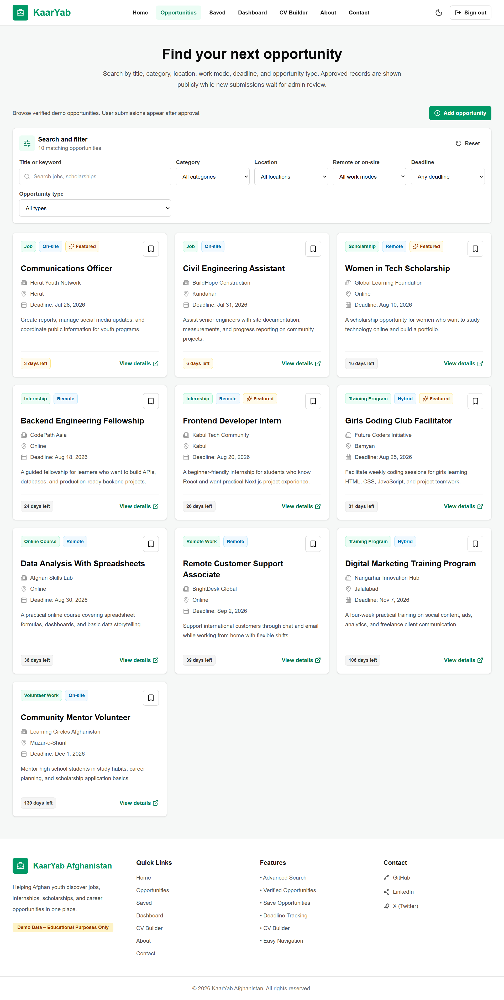

---

## Add Opportunity

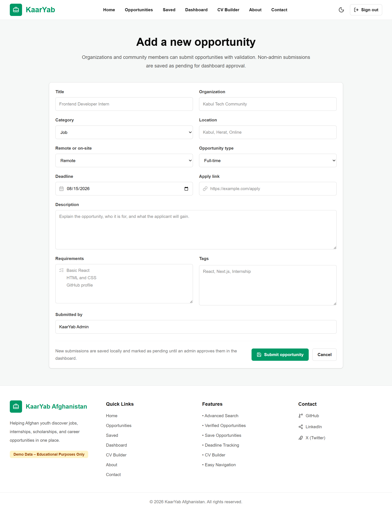

---

## Opportunity Details

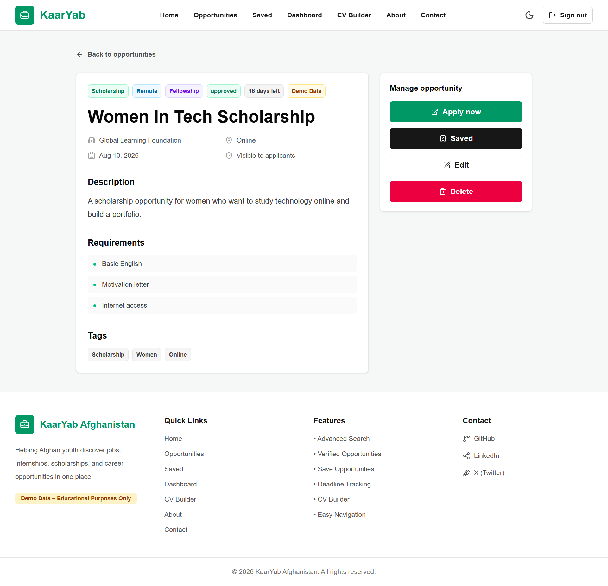

---

## Saved

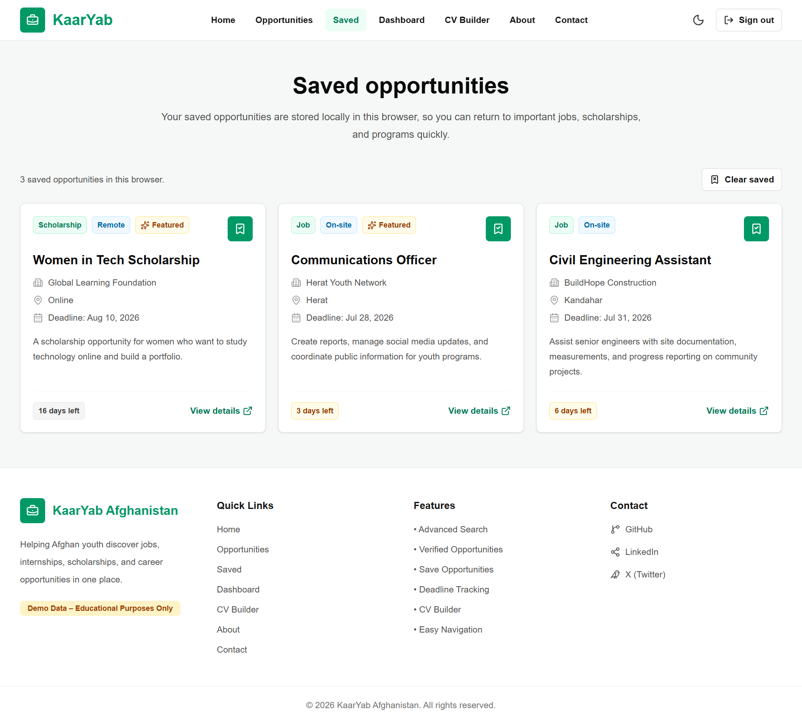

---

##  Dashboard

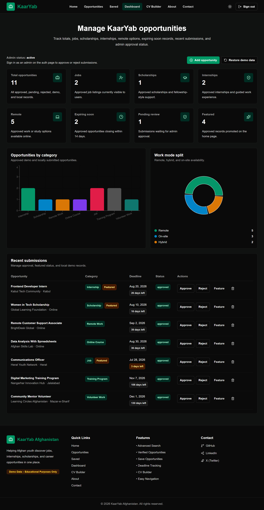

---

##  CV Builder

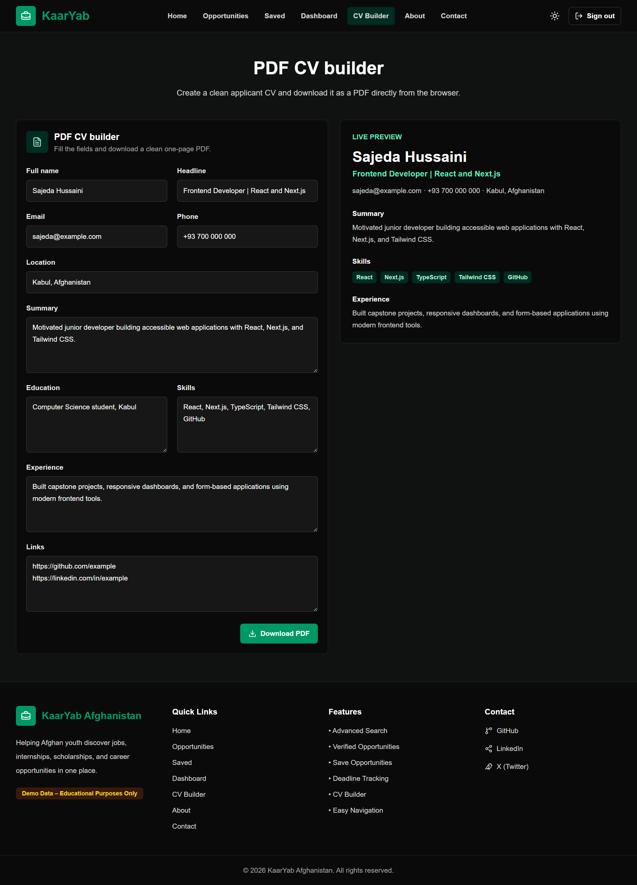

---

##  About

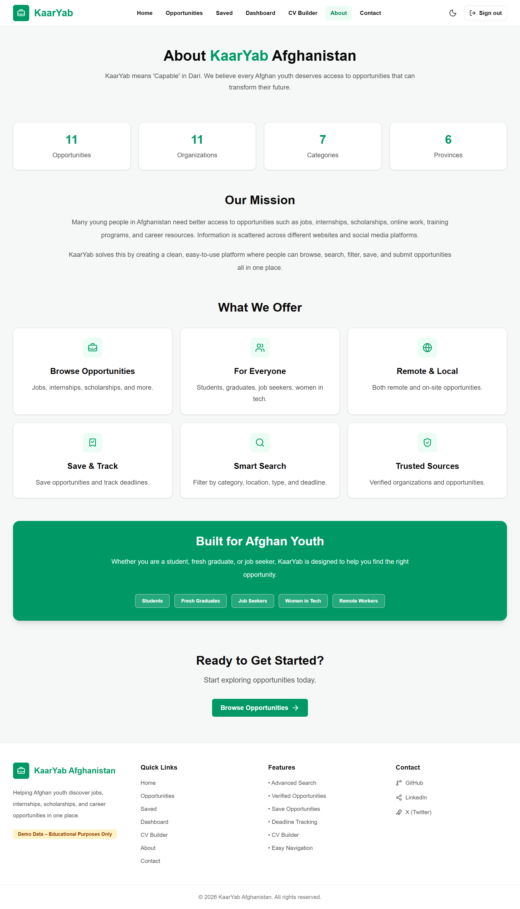

---

##  Contact

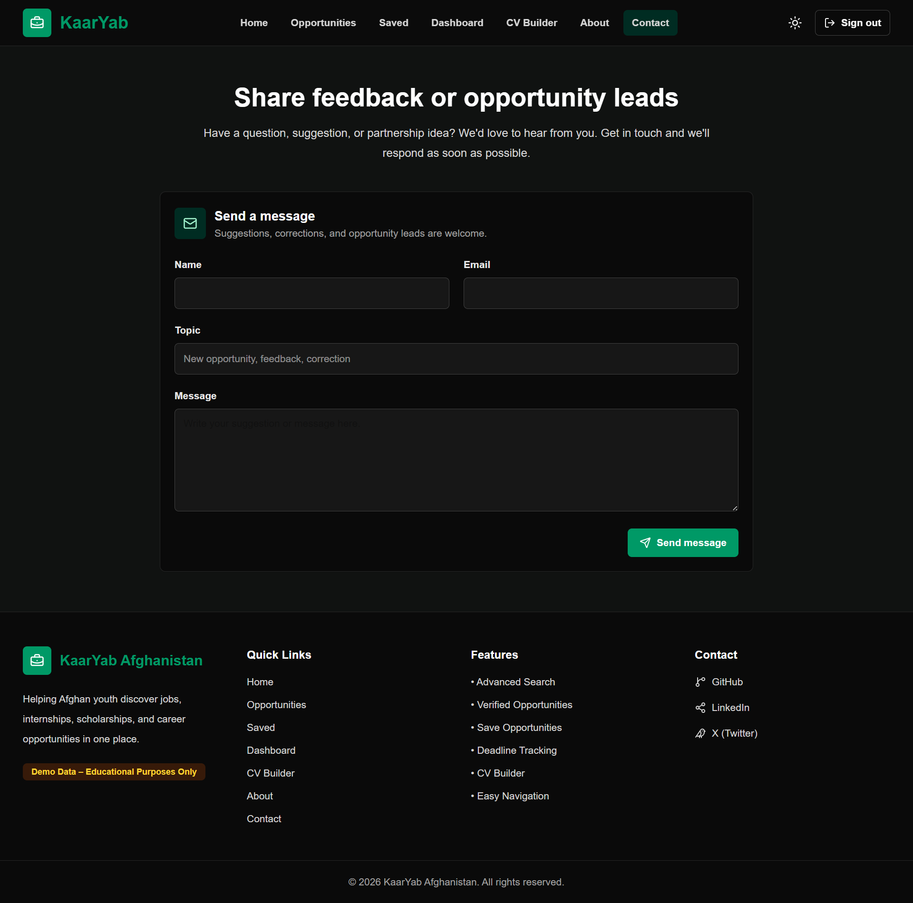

---

##  Sign In

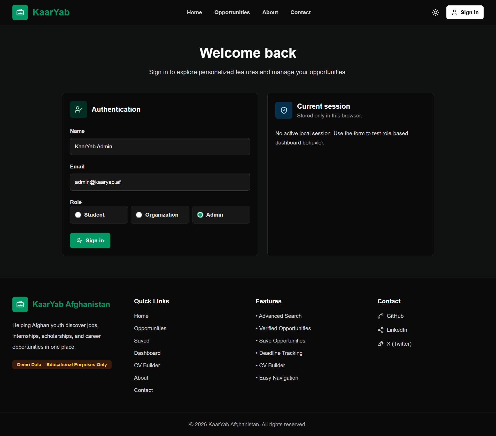

---

#  Live Demo

https://kaaryab-afghanistan-orcin.vercel.app/

---

#  GitHub Repository

https://github.com/SajedaHussaini/kaaryab-afghanistan

---

#  Future Improvements

- Database integration
- Real Authentication
- Protected Admin Dashboard
- Applicant Tracking System
- Organization Profiles
- Verified Opportunity Sources
- Email Notifications
- English / Dari / Pashto Localization

---

---

##  Let's Connect

<p align="center">

<a href="https://www.linkedin.com/in/sajeda-hussaini-183613396?utm_source=share_via&utm_content=profile&utm_medium=member_android">

</a>

<a href="https://x.com/HussainiSajeda">

</a>

</p>

<p align="center">
 If you found this project useful, consider giving it a star ⭐ on GitHub.
</p>
